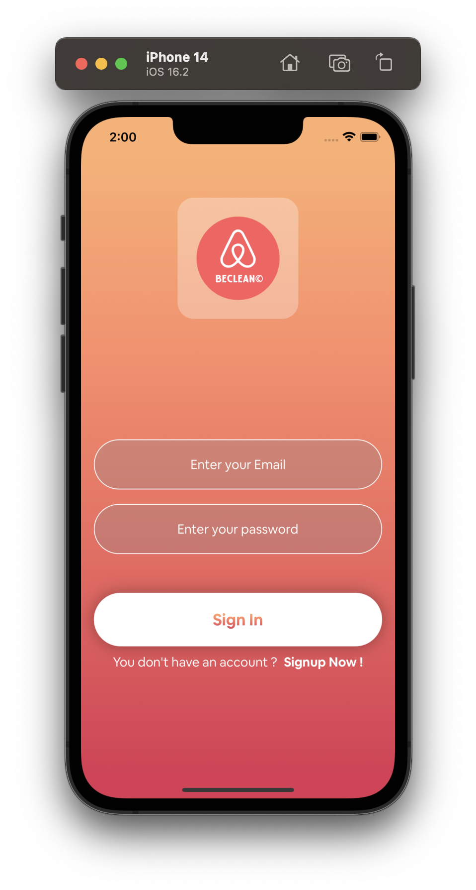
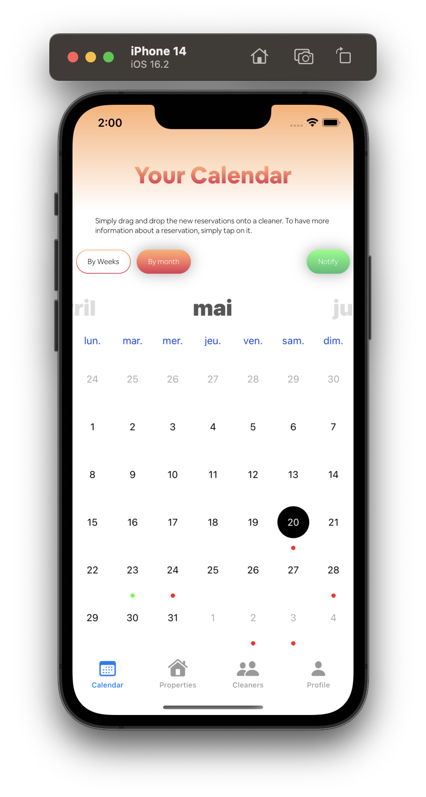
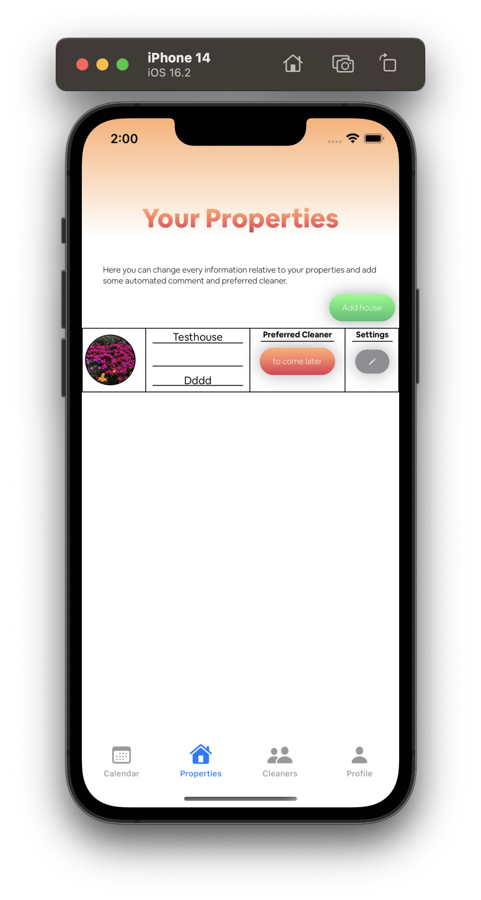

# BeClean
An ios app that let the user easily manage its airbnb cleaning.

  

## Features
- Login/Signup via Firebase
- Custom calendar with all airbnb cleaning displayed
- Add house to the app by using ical links
- Add cleaners to the app
- Send messages automatically to the cleaners to alert them of a new cleaning

## Who worked on it ?

I'm the only one to have worked on this app. I've learned all the basics of Swift, SwiftUI and Firebase in order to build this app.

## Objective

The objective of is to publish this app to the Appstore

## Images

#### The login

#### The Calendar

#### The houses

#### The cleaners

